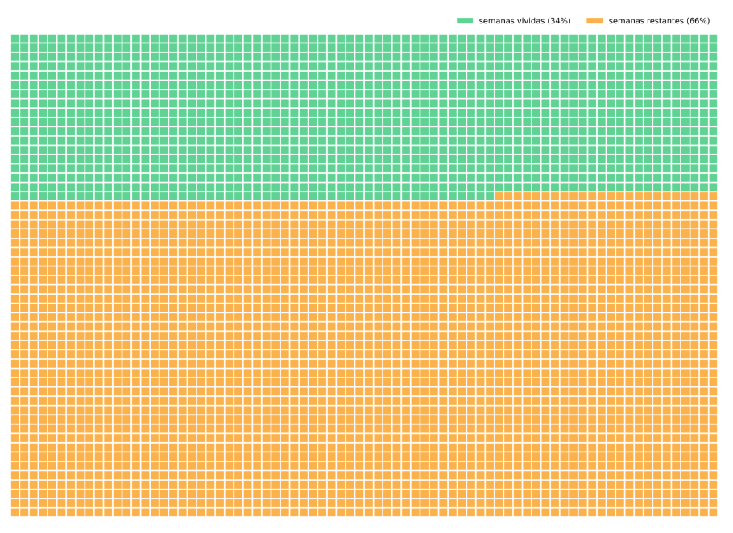

# Semanas de Vida

Você já parou para pensar em quanto tempo ainda tem de vida?

Refleti sobre esse tema em [um texto](https://alexandrealves.substack.com/p/voce-ja-parou-para-pensar-em-quanto?r=28qyby&utm_campaign=post&utm_medium=web) de minha newsletter onde utilizei dados de expectativa de vida do IBGE para criar alguns gráficos sobre quanto tempo é esperado que uma pessoa viva.

A partir dos dados, criei um [App no Streamlit](https://semanas-de-vida.streamlit.app/) onde é possível colocar sua data de nascimento e seu sexo para calcular quantas semanas você ainda tem de vida.

## Utilizando o App

### Dados de uma pessoa

**Inputs:**

- Data de nascimento
- Sexo

**Output:**

Quantidade de semanas vividas e quantidade de semanas restantes.

### Comparação entre pessoas

**Inputs:**

- Dada de nascimento da primeira pessoa
- Sexo da primeira pessoa
- Data de nascimento da segunda pessoa
- Sexo da segunda pessoa

**Output:**

Quantidade de semanas vividas por cada pessoa e quantidade de semanas restantes para cada pessoa.

